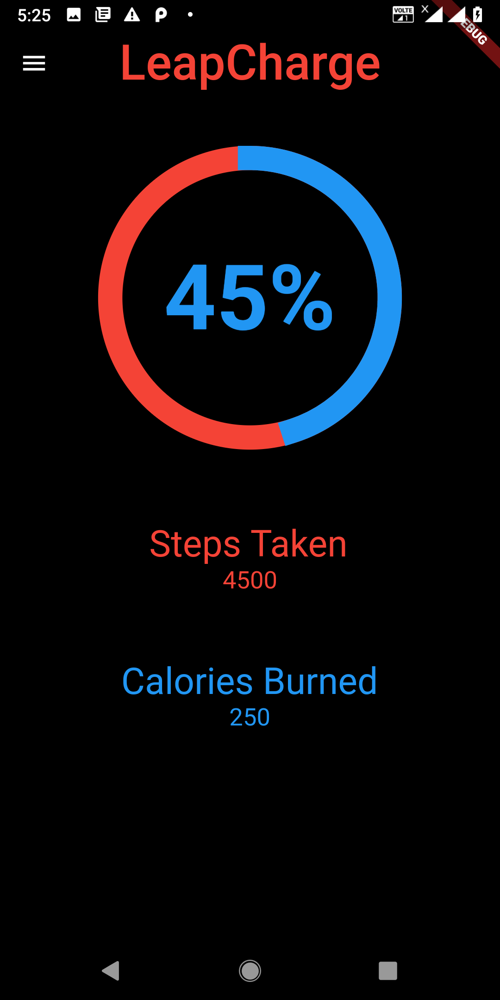

# LeapCharge

The LeapCharge project deals with creating an efficient energy source. The project is designed to promote health by creating a shoe insole that converts the physical energy into electricity. In the process the Shoe evolves into a Smart Device.

## Features
<ul>
<li>Charging : The Charging Module will convert Vibrational Energy into Electrical energy to charge the battery.</li>
<li>Step-Counting/Calories : The Step-Counting  Module counts the number of steps and calculates the calories burnt.</li>
<li>Tracking : A GPS-enable tracking module to track the location of the user.</li>
<li>Health- A track of the amount of steps the user has taken in the past month will be recorded and according to it the number of calories burned will be shown per day.</li>
</ul>

# Circuit Diagram

# Screenshots

App made using flutter

1. Current Records
    

2. Past Records

